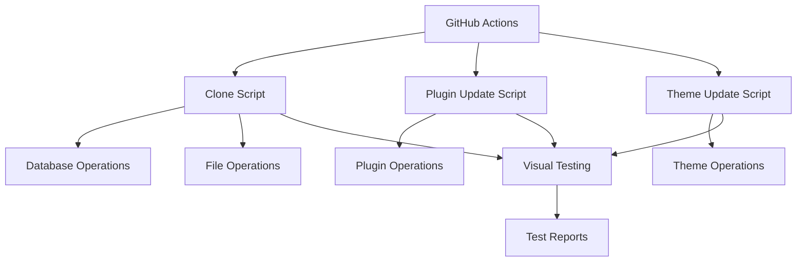

# WordPress Site Automation - Developer Guide

## Table of Contents
1. [Architecture](#architecture)
2. [Development Setup](#development-setup)
3. [Code Structure](#code-structure)
4. [Adding New Features](#adding-new-features)
5. [Testing](#testing)
6. [Deployment](#deployment)

## Architecture

### Overview

The WordPress Site Automation tool consists of several components:

1. **GitHub Actions Workflows**
   - Site cloning workflow
   - Plugin update workflow
   - Theme update workflow
   - Environment setup
   - Secrets management

2. **Shell Scripts**
   - Site cloning operations
   - Plugin update operations
   - Theme update operations
   - Database migrations
   - File operations

3. **Visual Regression Testing**
   - Uses BackstopJS for testing
   - Configurable test scenarios
   - CI/CD integration

### Component Interaction



## Development Setup

### Local Development Environment

1. Clone the repository:
   ```bash
   git clone https://github.com/your-org/wordpress-automation.git
   cd wordpress-automation
   ```

2. Install dependencies:
   ```bash
   npm install
   ```

3. Set up environment variables:
   ```bash
   cp .env.example .env
   # Edit .env with your local configuration
   ```

4. Install development tools:
   ```bash
   npm install -g backstopjs
   npm install -g @wordpress/env
   ```

### Testing Environment

1. Set up local WordPress environment:
   ```bash
   wp-env start
   ```

2. Configure test database:
   ```bash
   wp-env run cli wp db create
   ```

3. Run tests:
   ```bash
   npm test
   ```

## Code Structure

```
wordpress-automation/
├── .github/
│   └── workflows/
│       ├── clone-site.yml
│       ├── update-plugins.yml
│       └── update-themes.yml
├── scripts/
│   ├── clone-site.sh
│   ├── update-plugins.sh
│   └── update-themes.sh
├── tests/
│   └── backstop.json
├── config/
│   └── sites.json
└── docs/
    ├── UserGuide.md
    ├── DeveloperGuide.md
    └── API.md
```

### Key Components

1. **Workflow Files**
   - Located in `.github/workflows/`
   - Define GitHub Actions workflows
   - Handle environment setup and execution
   - Manage secrets and credentials

2. **Shell Scripts**
   - Located in `scripts/`
   - Implement core functionality
   - Handle system operations
   - Manage backups and rollbacks

3. **Test Configuration**
   - Located in `tests/`
   - Define visual regression tests
   - Configure test scenarios
   - Handle test reporting

4. **Configuration Files**
   - Located in `config/`
   - Store site-specific settings
   - Manage environment variables
   - Handle site configurations

## Adding New Features

### Development Process

1. Create a new branch:
   ```bash
   git checkout -b feature/your-feature-name
   ```

2. Implement changes:
   - Follow coding standards
   - Add tests
   - Update documentation

3. Test locally:
   ```bash
   npm test
   ```

4. Create pull request:
   - Include description
   - Link related issues
   - Request reviews

### Coding Standards

1. **Shell Scripts**
   - Use bash strict mode
   - Include error handling
   - Add logging
   - Document functions
   - Handle backups

2. **GitHub Actions**
   - Use latest action versions
   - Include proper error handling
   - Add status checks
   - Handle secrets securely

3. **Documentation**
   - Update relevant guides
   - Add inline comments
   - Include examples
   - Document API changes

## Testing

### Visual Regression Testing

1. Configure test scenarios:
   ```json
   {
     "scenarios": [
       {
         "label": "Homepage",
         "url": "https://example.com",
         "selectors": ["viewport"]
       }
     ]
   }
   ```

2. Run tests:
   ```bash
   backstop test
   ```

3. Review results:
   - Check test reports
   - Update baselines
   - Fix failures

### Unit Testing

1. Write test cases:
   ```javascript
   describe('clone-site', () => {
     it('should handle database migration', () => {
       // Test implementation
     });
   });
   ```

2. Run tests:
   ```bash
   npm test
   ```

## Deployment

### Release Process

1. Version bump:
   ```bash
   npm version patch|minor|major
   ```

2. Create release:
   - Tag the release
   - Update changelog
   - Deploy to production

3. Monitor deployment:
   - Check workflow status
   - Verify functionality
   - Update documentation

### Environment Management

1. Development
   - Local testing
   - Feature development
   - Unit testing

2. Staging
   - Integration testing
   - Visual regression testing
   - User acceptance testing

3. Production
   - Live deployments
   - Monitoring
   - Maintenance

## Contributing

### Pull Request Process

1. Fork the repository
2. Create feature branch
3. Implement changes
4. Add tests
5. Update documentation
6. Create pull request

### Code Review Guidelines

1. **Code Quality**
   - Follow standards
   - Include tests
   - Update documentation
   - Handle errors properly

2. **Security**
   - No hardcoded credentials
   - Proper error handling
   - Input validation
   - Secure file operations

3. **Performance**
   - Optimize operations
   - Minimize dependencies
   - Efficient resource usage
   - Proper cleanup

## Support

### Getting Help

1. Check documentation
2. Review issues
3. Contact maintainers
4. Create new issue

### Maintenance

1. Regular updates
2. Security patches
3. Dependency updates
4. Documentation updates 